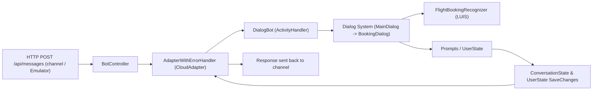

# chatbots-and-ms-foundry
This project has been made learning on how to use  Microsoft Bot Framework SDK to create chatbots of many kinds. Here will be all my notes.

## Contents
- [Basics and Key Concepts](#basics-and-key-concepts)
    - [Azure Bot Serivce](#azure-bot-service)
    - [Bot Framework](#bot-framework)
        - [Bot Adapter](#bot-adapter)
        - [Activities](#activities)
        - [Turns](#turns)
- [R2D2 Chatbot](#rd2d-chatbot)
- [Class Diagram and Description](#class-diagram-and-description)
    - [Startup.cs](#startupcs)
    - [AdapterWithErrorHandler.cs](#adapterwitherrorhandlercs)
    - [DialogAndWelcomeBot.cs](#dialogandwelcomebotcs)
    - [DialogBot.cs](#dialogbotcs)
    - [MainDialog.cs](#maindialogcs)
    - [FlightBookingRecognizer.cs](#flightbookingrecognizercs)
    - [FlightBooking.json](#flightbookingjson)
- [R2D2 .ChatBot.Tests](#r2d2chatbottests)
    - [Purpose](#purpose)
    - [Key packages used](#key-packages-used)
    - [Test architecture — how tests work](#test-architecture--how-tests-work)
    - [Files and classes (detailed)](#files-and-classes-detailed)
    - [How to run the tests](#how-to-run-the-tests)
    - [Best practices demonstrated](#best-practices-demonstrated)
    - [Further reading](#further-reading)]

## Basics and Key Concepts
### Azure Bot Service
A bot is an app that users interacts with in a conversational way, using text, graphics (such as cards or images), or speech. Azure Bot Service is a cloud platform. It hosts bots and makes them available to *channels*, such as Microsoft Teams, Facebook or Slack.

#### Bot Framework
The Bot Framework Service, which is a component of Azure IA Bot Service, sends information between the user's bot-connected app and the bot. Each channel can include additional information in the activities they send.

The Bot Framework Service sends a *conversation update* when a party joins the conversation. For example, on starting a conversation with the Bot Framework Emulator, you might see two conversation update activities (on for the user joining the conversation and one for the bot joining).

The Bot Framework SDK allows you to build bots that can be hosted on the Azure AI Bot Service. This service defines a REST API and an activity protocol for how your bot and channels or users can interact. A bot interaction involves the exchange of ***activities***, which are handled in ***turns***.

### Bot Adapter
An adapter class that implements the Bot Framework Protocol an can be hosted in different cloud environments. Inherits from **Microsoft.Bot.Builder.Integration.AspNet.Core.CloudAdapter**. The adapter:
- Provides a method for handling requests from and methods for generating requests to the user's channel.
- Includes middleware pipeline which include turn processing outside your bot's turn handler.
- Calls the bot's turn handler and catches errors not otherwise handled in the turn handler.

### Activities
Every interaction between the user (or a channel) and the bot is represented as an *activity*. Activities can represent human text of speech, app-to-app notifications, reactions and other messages, and so on. Please read [Activity Schema](https://github.com/Microsoft/botframework-sdk/blob/main/specs/botframework-activity/botframework-activity.md) for further details.

### Turns
In Bot Framework SDK, a *turn* consists of the user's incoming activity to the bot and any activity the bot sends back to the user as an immediate response. For example if the user wants to perform a certain task, the bot might respond with a question to get more details about the task.

## RD2D Chatbot
This bot has been created using .NET 6.0 Microsoft Bot Framework Core Bot template which includes a functional flight scheduled bot using LUIS with unit tests. However it has been modified to do something different in order to learn Bot Framework capabilities. Here I'm describing what I have done and found through the code so far.

Starting from the begining, this is a .NET 8.0 ASP.NET Core Web API application at its finest. Just one controller which is used by the bot itself. However there are many components which I'm describing as I'm understanding them. I will try to list them as they are required on the application to run and interact in order of execution.



List of package references:
```xml
    <PackageReference Include="Microsoft.AspNetCore.Mvc.NewtonsoftJson" Version="3.1.1" />
    <PackageReference Include="Microsoft.Bot.Builder.AI.Luis" Version="4.22.0" />
    <PackageReference Include="Microsoft.Bot.Builder.Dialogs" Version="4.22.0" />
    <PackageReference Include="Microsoft.Bot.Builder.Integration.AspNet.Core" Version="4.22.0" />
    <PackageReference Include="Microsoft.Recognizers.Text.DataTypes.TimexExpression" Version="1.4.0" />
```

## Class Diagram and Description
```classDiagram
  "ActivityHandler" <|-- "DialogBot<T>"
  "DialogBot<T>" <|-- "DialogAndWelcomeBot<T>"
  "CloudAdapter" <|-- "AdapterWithErrorHandler"
  "ComponentDialog" <|-- "MainDialog"
  "ComponentDialog" <|-- "CancelAndHelpDialog"
  "CancelAndHelpDialog" <|-- "BookingDialog"
  "CancelAndHelpDialog" <|-- "DateResolverDialog"

  "MainDialog" --> "BookingDialog"
  "MainDialog" --> "FlightBookingRecognizer"
  "MainDialog" --> "BookingDetails"
  "BookingDialog" --> "BookingDetails"
  "DateResolverDialog" --> "BookingDialog"

  "Startup" --> "AdapterWithErrorHandler"
  "Startup" --> "FlightBookingRecognizer"
  "Startup" --> "BookingDialog"
  "Startup" --> "MainDialog"
  "Startup" --> "DialogAndWelcomeBot<MainDialog>"

  "BotController" --> "IBotFrameworkHttpAdapter"
  "BotController" --> "IBot"

  "FlightBookingRecognizer" ..|> "IRecognizer"
  "FlightBooking" ..|> "IRecognizerConvert"
```

### Startup.cs
This class basically defines how the ASP.NET Core application will work by setting injection dependency on **ConfigureServices** void.
- Adds HttpClient, Controllers and NewtonsoftJson.
- Adds a Singleton instance of **Microsoft.Bot.Connector.Authentication.BotFrameworkAuthentication** and **Microsoft.Bot.Builder.Integration.AspNet.Core.ConfigurationBotFrameworkAuthentication** which are going to be used with the **Bot Adapter**.
- Adds a Singleton instance of an implementation of **Microsoft.Bot.Builder.IStorage** to store user and conversation state by an instance of **MemoryStorage**.
- Adds a Singleton instance of **Microsoft.Bot.Builder.UserState** which is used in this bot's Dialog implementations.
- Adds a Singleton instance of **Microsoft.Bot.Builder.ConversationState** which is used by the Dialog system itself.
- Adds a Singleton implementation of **Microsoft.Bot.Builder.IRecognizer** to use Language Understanding Intelligent Service (LUIS). This is represented by [FlightBookingRecognizer.cs](#flightbookingrecognizercs) class.
- Registers singleton instances of [BookingDialog.cs](#bookingdialogcs) and [MainDialog.cs](#maindialogcs) dialogs used by the bot.
- Creates the bot as a transient by adding an implementation of **Microsoft.Bot.Builder.IBot**. In this case the [BotController.cs](#botcontrollercs) is expecting an IBot implementation which is [DialogAndWelcomeBot.cs](#dialogandwelcomebotcs) of type [MainDialog.cs](#maindialogcs). Notice that both [DialogAndWelcomeBot.cs](#dialogandwelcomebotcs) and [MainDialog.cs](#maindialogcs) are actually an implementation of **Microsoft.Bot.Builder.ActivityHandler**.

#### Storage
There are three different main types of storage that can be used with Bot Framework SDK:
- **Memory Storage**: This is an in-memory storage provider that is useful for testing and development purposes. However, it does not persist data across application restarts.
- **Cosmos DB Storage**: This is a cloud-based storage provider that uses Azure Cosmos DB to store bot state data. It is a scalable and highly available option for production scenarios.
- **Blob Storage**: This is another cloud-based storage provider that uses Azure Blob Storage to store bot state data. It is a cost-effective option for storing large amounts of data.

### AdapterWithErrorHandler.cs
This class inherits from **Microsoft.Bot.Builder.Integration.AspNet.Core.CloudAdapter** and it is used to handle errors that occur during the bot's turn processing. It overrides the ***OnTurnError*** method to log the error and send a message to the user indicating that an error has occurred and deleting conversation state to avoid bot from getting stuck in an error-loop by being in a bad state.

### DialogAndWelcomeBot.cs
This class does is the bot itself. It inherits from **Microsoft.Bot.Builder.IBot** and it is injected by **Microsoft.Bot.Builder.ConversationState**, **Microsoft.Bot.Builder.UserState** and *generic dialogs*. Its main behavior is an async task ***OnMembersAddedAsync*** which initializes the conversation to every member by sending them an ***Adaptive Card*** as a result of private [CreateAdaptiveCardAttachment](#createadaptivecardattachment) Attachment function.

It inherits of **DialogBot\<T\>** where T is a type of dialog. In this case it is [MainDialog.cs](#maindialogcs) which is the main dialog of the bot.

##### CreateAdaptiveCardAttachment
Private **Attachment** function that returns an attachment set on a card resource definition from **welcomeCard.json**. This card attachment is used to provide more options to the user. You can define the style of the card. Here's an example:

```json
{
  "$schema": "http://adaptivecards.io/schemas/adaptive-card.json",
  "type": "AdaptiveCard",
  "version": "1.0",
  "body": [
    {
      "type": "Image",
      "url": "https://freepngimg.com/save/104620-photos-r2-d2-free-transparent-image-hq/840x771",//I have changed card image from default Bot Framework icon to a picture of RD2D.
      "size": "stretch"
    },
    {
      "type": "TextBlock",
      "spacing": "medium",
      "size": "default",
      "weight": "bolder",
      "text": "Welcome to R2D2!",//I have change welcome text here too.
      "wrap": true,
      "maxLines": 0
    },
    {
      "type": "TextBlock",
      "size": "default",
      "isSubtle": true,
      "text": "Now that you have successfully run your bot, follow the links in this Adaptive Card to expand your knowledge of Bot Framework.",
      "wrap": true,
      "maxLines": 0
    }
  ],
  "actions": [ //Here is some interesting stuff, you can show options to the user. Every option has its own action to do.
    {
      "type": "Action.OpenUrl",
      "title": "Get an overview",
      "url": "https://docs.microsoft.com/en-us/azure/bot-service/?view=azure-bot-service-4.0"
    },
    {
      "type": "Action.OpenUrl",
      "title": "Ask a question",
      "url": "https://stackoverflow.com/questions/tagged/botframework"
    },
    {
      "type": "Action.OpenUrl",
      "title": "Learn how to deploy",
      "url": "https://docs.microsoft.com/en-us/azure/bot-service/bot-builder-howto-deploy-azure?view=azure-bot-service-4.0"
    }
  ]
}
```

### DialogBot.cs
This is a generic class that inherits from **Microsoft.Bot.Builder.ActivityHandler** and it is used to handle incoming activities. It is inherited by [DialogAndWelcomeBot.cs](#dialogandwelcomebotcs) class. It has two main async tasks:
- ***OnMessageActivityAsync***: This task is triggered when the bot receives a message activity from the user. It runs the dialog system by calling ***Run*** method of **Microsoft.Bot.Builder.Dialogs.Dialog** class.
- OnTurnAsync: This task is triggered on every turn of the conversation with the user. It saves any state changes that might have occurred during the turn by calling ***SaveChangesAsync*** method of **Microsoft.Bot.Builder.ConversationState** and **Microsoft.Bot.Builder.UserState** classes.

### MainDialog.cs
This class inherits from **Microsoft.Bot.Builder.Dialogs.ComponentDialog** and it is the main dialog of the bot. It is injected by **Microsoft.Bot.Builder.IRecognizer** implementation and [BookingDialog.cs](#bookingdialogcs) dialog. On its constructor sets a **WaterfallDialog** (which a delegate definition of dialog steps optimized for prompting a user with series of questions. More information [here](https://learn.microsoft.com/en-us/dotnet/api/microsoft.bot.builder.dialogs.waterfalldialog?view=botbuilder-dotnet-stable). The waterfall dialog has three steps:
#### ***IntroStepAsync***
This step is called first and it prompts the user with a choice prompt asking how the bot can help them.

#### ***ActStepAsync***
This step is called after the user responds to the choice prompt. It uses LUIS to recognize the user's intent and decides what to do next based on the recognized intent from [FlightBooking.cs](#flightbookingcs):

If LUIS is not configured, the bot will begin [BookingDialog.cs](#bookingdialogcs) dialog by default with an empty instance of BookingDetails.

If LUIS is configured, the bot will check the top intent returned by LUIS:

- If the intent is "BookFlight", the bot will start the [BookingDialog.cs](#bookingdialogcs) dialog with BookingDetails pre-filled with entities extracted from LUIS.
- If the intent is "GetWeather", the bot will respond with a message indicating that it can provide weather information (this is a placeholder for actual weather functionality).
- For any other intent, the bot will respond with a message indicating that it did not understand the request, this applies for the "None" and "Cancel" intents as well.

Note that in this step, LUIS can be used to get entities from the user's input to pre-fill some information in the BookingDialog, otherwise you may have to build a FormFlow to gather all necessary information. So, with LUIS enabled, a switch case will determine the users's intent and act accordingly. 

#### ***FinalStepAsync***
This step is called last and it ends the dialog. It tells the user that their request has been completed and thanks them for using the bot, finally it asks if there is something else it can help with and restart the conversation by replacing current dialog with InitialDialog value of the context.

### FlightBookingRecognizer.cs
This class implements **Microsoft.Bot.Builder.IRecognizer** and it is used to recognize intents and entities from user input using LUIS. It has a constructor that takes **Microsoft.Bot.Builder.AI.Luis.LuisApplication** and **Microsoft.Bot.Builder.AI.Luis.LuisPredictionOptions** as parameters to configure the LUIS recognizer.

### FlightBooking.json
This JSON file does define the model for LUIS. It contains intents, entities, and utterances that are used to train the LUIS model for recognizing user input related to flight booking.

### FlightBooking.cs
This class is the object representation of FlightBooking LUIS model. It contains properties for the recognized intents and entities from user input.

### BookingDialog.cs
Similar to [MainDialog.cs](#maindialogcs), this class inherits from **Microsoft.Bot.Builder.Dialogs.ComponentDialog** and it is used to handle the flight booking process. It is injected by **Microsoft.Bot.Builder.IRecognizer** implementation. On its constructor sets a **WaterfallDialog** with several steps to gather information from the user about their flight booking. There are few steps in this dialog:
#### ***DestinationStepAsync***
This step prompts the user for their destination if it is not already provided in the booking details.
#### ***OriginStepAsync***
This step prompts the user for their origin if it is not already provided in the booking details.
#### ***TravelDateStepAsync***
This step prompts the user for their travel date if it is not already provided in the booking details.
#### ***ConfirmStepAsync***
This step prompts the user to confirm the booking details they have provided.
#### ***FinalStepAsync***

### DialogBot.cs
This is a generic class that inherits from **Microsoft.Bot.Builder.ActivityHandler** and it is used to handle incoming activities. It is inherited by [DialogAndWelcomeBot.cs](#dialogandwelcomebotcs) class. It has two main async tasks:
- ***OnMessageActivityAsync***: This task is triggered when the bot receives a message activity from the user. It runs the dialog system by calling ***Run*** method of **Microsoft.Bot.Builder.Dialogs.Dialog** class.
- OnTurnAsync: This task is triggered on every turn of the conversation with the user. It saves any state changes that might have occurred during the turn by calling ***SaveChangesAsync*** method of **Microsoft.Bot.Builder.ConversationState** and **Microsoft.Bot.Builder.UserState** classes.

### MainDialog.cs
This class inherits from **Microsoft.Bot.Builder.Dialogs.ComponentDialog** and it is the main dialog of the bot. It is injected by **Microsoft.Bot.Builder.IRecognizer** implementation and [BookingDialog.cs](#bookingdialogcs) dialog. On its constructor sets a **WaterfallDialog** (which a delegate definition of dialog steps optimized for propmting a user with series of questions. More information [here](https://learn.microsoft.com/en-us/dotnet/api/microsoft.bot.builder.dialogs.waterfalldialog?view=botbuilder-dotnet-stable). The waterfall dialog has three steps:
#### ***IntroStepAsync***
This step is called first and it prompts the user with a choice prompt asking how the bot can help them.

#### ***ActStepAsync***
This step is called after the user responds to the choice prompt. It uses LUIS to recognize the user's intent and decides what to do next based on the recognized intent from [FlightBooking.cs](#flightbookingcs):

If LUIS is not configured, the bot will begin [BookingDialog.cs](#bookingdialogcs) dialog by default with an empty instance of BookingDetails.

If LUIS is configured, the bot will check the top intent returned by LUIS:

- If the intent is "BookFlight", the bot will start the [BookingDialog.cs](#bookingdialogcs) dialog with BookingDetails pre-filled with entities extracted from LUIS.
- If the intent is "GetWeather", the bot will respond with a message indicating that it can provide weather information (this is a placeholder for actual weather functionality).
- For any other intent, the bot will respond with a message indicating that it did not understand the request, this applies for the "None" and "Cancel" intents as well.

Note that in this step, LUIS can be used to get entities from the user's input to pre-fill some information in the BookingDialog, otherwise you may have to build a FormFlow to gather all necessary information. So, with LUIS enabled, a switch case will determine the users's intent and act accordingly. 

#### ***FinalStepAsync***
This step is called last and it ends the dialog. It tells the user that their request has been completed and thanks them for using the bot, finally it asks if there is something else it can help with and restart the conversation by replacing current dialog with InitialDialog value of the context.

### FlightBookingRecognizer.cs
This class implements **Microsoft.Bot.Builder.IRecognizer** and it is used to recognize intents and entities from user input using LUIS. It has a constructor that takes **Microsoft.Bot.Builder.AI.Luis.LuisApplication** and **Microsoft.Bot.Builder.AI.Luis.LuisPredictionOptions** as parameters to configure the LUIS recognizer.

### FlightBooking.json
This JSON file does define the model for LUIS. It contains intents, entities, and utterances that are used to train the LUIS model for recognizing user input related to flight booking.

### FlightBooking.cs
This class is the object representation of FlightBooking LUIS model. It contains properties for the recognized intents and entities from user input.

### BookingDialog.cs
Similar to [MainDialog.cs](#maindialogcs), this class inherits from **Microsoft.Bot.Builder.Dialogs.ComponentDialog** and it is used to handle the flight booking process. It is injected by **Microsoft.Bot.Builder.IRecognizer** implementation. On its constructor sets a 
**TextPrompt** dialog, a **ConfirmPrompt** dialog, and a [DateResolverDialog.cs](#dateresolverdialogcs) dialog to help with date input. It also sets a **WaterfallDialog** with several steps to gather information from the user about their flight booking.

Take also in mind that this class is inheriting from [CancelAndHelpDialog.cs](#cancelandhelpdialogcs) which provides common cancel and help functionality across all dialogs in the bot.

There are few steps in this dialog:
#### ***DestinationStepAsync***
This step prompts the user for their destination if it is not already provided in the booking details.
#### ***OriginStepAsync***
This step prompts the user for their origin if it is not already provided in the booking details.
#### ***TravelDateStepAsync***
This step prompts the user for their travel date if it is not already provided in the booking details.
#### ***ConfirmStepAsync***
This step prompts the user to confirm the booking details they have provided.
#### ***FinalStepAsync***
This step is called last and it ends the dialog. If the user confirmed the booking, it thanks them and provides a summary of their booking details. If the user did not confirm, it informs them that the booking has been cancelled.

### DateResolverDialog.cs
This class inherits from **Microsoft.Bot.Builder.Dialogs.ComponentDialog** and it is used to resolve date input from the user. It is used in [BookingDialog.cs](#bookingdialogcs) to help gather the travel date for the flight booking.

### CancelAndHelpDialog.cs
This class inherits from **Microsoft.Bot.Builder.Dialogs.ComponentDialog** and it provides common cancel and help functionality across all dialogs in the bot. It adds two prompts: a **TextPrompt** for help requests and a **ConfirmPrompt** for cancel requests. It also overrides the ***OnBeginDialogAsync*** and ***OnContinueDialogAsync*** methods to check for cancel or help requests before proceeding with the dialog.

## BotController.cs
This is a Web API endpoint controller that handles incoming request to the bot by exposing a single POST method at `/api/messages`. It is injected by **Microsoft.Bot.Builder.IBotFrameworkHttpAdapter** and **Microsoft.Bot.Builder.IBot** implementations. It is injected by **Microsoft.Bot.Builder.IBotFrameworkHttpAdapter** and **Microsoft.Bot.Builder.IBot** implementations which have been defined on [Startup.cs](#startupcs).

# R2D2.ChatBot.Tests

This project contains unit tests for the CoreBot sample built with Bot Framework v4. The tests demonstrate strategies for testing dialogs, bots and controllers using `Microsoft.Bot.Builder.Testing`, `xUnit` and `Moq`.

This README explains the test architecture, describes every test class and helper included in the project, and shows how to run the tests.

## Purpose

- Validate dialog flows turn-by-turn without running a web service.
- Test bot `ActivityHandler` behavior (e.g., welcome messages, conversation update handling).
- Show data-driven testing patterns for dialogs.
- Demonstrate use of mock objects to isolate dialog dependencies (LUIS, child dialogs, configuration).

## Key packages used

- `Microsoft.Bot.Builder.Testing`
- `xUnit`
- `Moq`

## Test architecture — how tests work

- `DialogTestClient` is used to test dialogs in isolation. It simulates a channel and allows sending activities and receiving the dialog's outgoing activities turn-by-turn.
- `TestAdapter` is used to simulate an adapter and drive end-to-end bot turns for `ActivityHandler` tests.
- `MemoryStorage`, `ConversationState`, and `UserState` are used as in-memory state stores so tests do not require external storage.
- `Moq` is used to create mock implementations of dependencies such as LUIS recognizers or child dialogs so a dialog under test can be exercised in isolation.
- Data-driven tests use `xUnit` `Theory` with `InlineData`, `MemberData`, or custom `ClassData` to cover multiple input/outcome combinations.

## Files and classes (detailed)

The project contains several test files and helper folders. Below are the important ones and what they test.

- `Bots/DialogAndWelcomeBotTests.cs`  
  - Tests the `DialogAndWelcomeBot<T>` bot behavior on conversation updates.  
  - Creates a mock root dialog using `SimpleMockFactory.CreateMockDialog<Dialog>(...)`, sets up `MemoryStorage`, and constructs `DialogAndWelcomeBot<Dialog>`.  
  - Creates an `Activity` of type `ConversationUpdate` and sends it to the bot via a `TestAdapter` using `ProcessActivityAsync`.  
  - Asserts the bot sends a welcome card (attachment count and content type `application/vnd.microsoft.card.adaptive`) and that the mocked dialog was started (asserts a reply text `"Dialog mock invoked"`).  
  - This test demonstrates using `TestAdapter` for adapter-level scenarios and verifying multiple replies produced as part of a single turn.

- `Dialogs/CancelAndHelpDialogTests.cs`  
  - Data-driven tests for the `CancelAndHelpDialog`.  
  - Uses `xUnit` `Theory` with `InlineData` to test multiple user utterances (e.g., "cancel", "help") and the expected dialog outcomes and responses.  
  - Uses `DialogTestClient` to run the dialog and assert the outgoing activities.

- `Dialogs/BookingDialogTests.cs`  
  - Exercises the `BookingDialog` using `DialogTestClient`.  
  - Contains `Theory` tests that use `MemberData` to load multiple test scenarios from a helper data generator class named `BookingDialogTestsDataGenerator`.  
  - Each scenario drives the dialog turn-by-turn, asserts prompts and final results, and validates the dialog collects the expected booking details.

- `Dialogs/MainDialogTests.cs`  
  - Tests `MainDialog` in isolation by mocking external dependencies: LUIS recognizer and the child `BookingDialog`.  
  - Uses `Moq` to configure recognizer results and child dialog behavior so tests focus exclusively on `MainDialog` routing and prompt logic.  
  - Demonstrates verifying that intents route to the correct dialogs and that prompts and reprompts are returned as expected.

- `Dialogs/TestData/` (folder)  
  - Contains test data generator classes and `MemberData`/`ClassData` sources used by `Theory` tests (e.g., `BookingDialogTestsDataGenerator`).  
  - These generators create structured test cases that represent realistic dialog conversation sequences.

- `Common/` (folder)  
  - Contains helper classes and extensions to make tests concise and consistent. Common helpers typically include:
    - `SimpleMockFactory` — helper to create mock dialogs and simple mock objects used by tests (used in `DialogAndWelcomeBotTests`).  
    - Test adapter / activity extension helpers for creating test activities, assertions, or simplifying `DialogTestClient` usage.  
  - The helpers are designed to centralize common mocking and test initialization patterns.

## How to run the tests

- In Visual Studio 2022: open the solution, build, then run tests from Test Explorer.
- From the command line:
  - Restore and build: `dotnet build`
  - Run tests: `dotnet test`

## Best practices demonstrated

- Keep dialog tests small and focused — exercise a single dialog or a single turn of bot logic.
- Use `DialogTestClient` to drive dialog turns and assert outgoing activities exactly in order.
- Use `TestAdapter` for higher-level `ActivityHandler` tests when you need to simulate a full TurnContext and adapter behavior.
- Use `Moq` to replace external services (LUIS, QnA, child dialogs) so tests are deterministic and fast.
- Use data-driven `Theory` tests to cover multiple scenarios without duplicating test code.

## Further reading

- How to unit test bots: https://aka.ms/cs-unit-test-docs  
- `Microsoft.Bot.Builder.Testing` docs and samples.  
- xUnit: https://xunit.net/  
- Moq: https://github.com/moq/moq